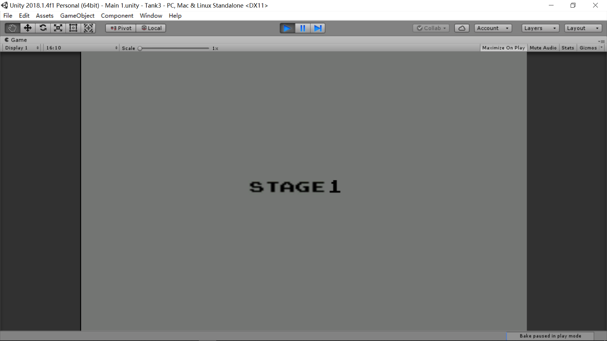

## TankBattle2D

#### 开发工具：Unity3d
#### 编辑语言：C#
#### 项目类型：2D单机版游戏
#### 游戏名称：坦克大战
#### 游戏简介：
> 项目是通过Unit3D开发的一个2D游戏小项目。
游戏体验和小时候玩的坦克大战基本相似(至少画面是相同的...hh)。
游戏分为单人和双人模式，单人模式因为时间限制只制作了5关游戏，双人游戏是电脑随机生成的地图。
玩家1 WSDA控制方向，J控制子弹发射；玩家2键盘上下左右控制方向，空格发射子弹；
游戏中可以吃道具使自己加强，具体可以见以下图片。
#### 开发者联系：
leemail99@foxmail.com

##### 1.游戏开始界面
* 可以选择单人游戏或双人游戏

##### 2.关卡选择界面
可以通过W S键控制游戏关卡的选择

##### 3.游戏界面
* 第一关界面

* 打到红坦克随机产生道具界面

* 坦克吃到道具

* 双人模式

